# Problem 1-1: Comparison of running times

For each function _f(n)_ and time _t_ in the following table, determine the largest
size _n_ of a problema that can be solved in time _t_, assuming that the algorithm to
solve the problem takes _f(n)_ microsseconds.

|                 | 1 second | 1 minute | 1 hour | 1 day | 1 month | 1 year | 1 century |
|-----------------|:--------:|:--------:|:------:|:-----:|:-------:|:------:|:---------:|
| 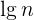 |          |          |        |       |         |        |           |
| 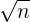 |          |          |        |       |         |        |           |
| 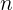 |          |          |        |       |         |        |           |
| 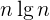 |          |          |        |       |         |        |           |
| 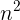 |          |          |        |       |         |        |           |
| 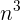 |          |          |        |       |         |        |           |
| 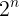 |          |          |        |       |         |        |           |
| 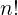 |          |          |        |       |         |        |           |

## Reposta
Considerando que 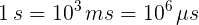, o maior número _n_ quando _f(n) = n_
é dado diretamente por:

|                 | 1 second | 1 minute | 1 hour | 1 day | 1 month | 1 year | 1 century |
|-----------------|:--------:|:--------:|:------:|:-----:|:-------:|:------:|:---------:|
|  | 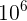 | 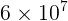 | 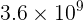 | 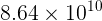 | 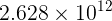 | 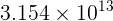 | 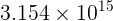 |

Quando _f(n) = \sqrt{n}_, o maior _n_ é dado pela inversa da função, ou seja, por _n^2_. Assim:

|                 | 1 second | 1 minute | 1 hour | 1 day | 1 month | 1 year | 1 century |
|-----------------|:--------:|:--------:|:------:|:-----:|:-------:|:------:|:---------:|
|  | 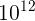 | 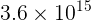 |  |  |  |  |  |
|  |  |  |  |  |  |  |  |